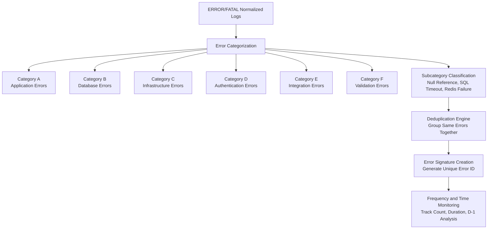

# Error Categorization Flow

This POC follows the A-F categorization format below.



## Category Rules

| Code | Category | Example subcategories | Example matching rules |
|---|---|---|---|
| A | Application Errors | Null Reference, Invalid Operation, Collection or Key Error | `NullReferenceException`, `InvalidOperationException`, `KeyNotFoundException` |
| B | Database Errors | SQL Timeout, Database Deadlock, Connection String Issue | `SqlException`, `DbContext`, `JDBC`, `timeout expired`, `deadlock` |
| C | Infrastructure Errors | Redis Failure, Network Connectivity, Memory Pressure | `RedisConnectionException`, `SocketException`, `DNS`, `OutOfMemoryException`, `Docker`, `Kubernetes` |
| D | Authentication Errors | Token Expired, Invalid Token, Unauthorized Access | `401`, `403`, `JWT`, `SecurityTokenExpiredException`, `UnauthorizedAccessException` |
| E | Integration Errors | HTTP Integration Failure, Bad Gateway, Rate Limited | `HttpRequestException`, `502`, `503`, `429`, `webhook`, `external API` |
| F | Validation Errors | Missing Required Value, Invalid Format, Invalid Request Body | `ArgumentNullException`, `FormatException`, `BadHttpRequestException`, `validation failed` |

## How It Works In Code

Implementation file:

```text
backend/ELKMonitor.API/Categorization/CategorizationEngine.cs
```

Flow:

1. `LogDocumentConverter` reads raw Elasticsearch documents from different field shapes.
2. `LogService.NormalizeDocument` converts every raw document into `NormalizedLog`.
3. `RuleBasedCategorizationEngine.Classify(...)` checks priority-ordered keyword/regex rules.
4. The engine returns `CategoryCode`, `Category`, `Subcategory`, `NormalizedMessage`, and `ErrorSignature`.
5. Dashboard top errors group by `ErrorSignature`, not by the raw message.
6. D-1 analysis compares the last 24 hours against the previous 24 hours for each signature.

## Deduplication Signature

The signature is generated from:

```text
CategoryCode + Subcategory + ExceptionType + ApplicationName + NormalizedMessage
```

This groups repeated versions of the same error even when the message contains changing IDs, timestamps, counts, or quoted values.

Example:

```text
Original:   NullReferenceException: customer 123 was null at 2026-05-27T12:00:00Z
Normalized: nullreferenceexception: customer {number} was null at {timestamp}
Signature: A-2F47E9C1A18D43B0
```

## API Response Fields

`GET /api/logs` now includes:

```json
{
  "categoryCode": "A",
  "category": "Category A - Application Errors",
  "subcategory": "Null Reference",
  "errorSignature": "A-2F47E9C1A18D43B0",
  "normalizedMessage": "nullreferenceexception: object reference not set"
}
```

`GET /api/dashboard/top-errors` groups by signature and includes:

```json
{
  "errorSignature": "B-AC11314FBB91D9FA",
  "categoryCode": "B",
  "category": "Category B - Database Errors",
  "subcategory": "SQL Timeout",
  "count": 42,
  "firstOccurrence": "2026-05-26T10:00:00Z",
  "lastOccurrence": "2026-05-27T10:00:00Z",
  "last24HoursCount": 20,
  "previous24HoursCount": 12,
  "d1Delta": 8,
  "durationMinutes": 1440
}
```
